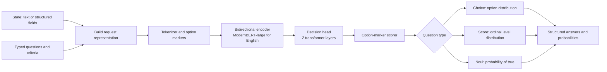

# Laya and Jev: Architecture and Training Study

This document separates public disclosures from interpretation. Laya's model
card and repository describe a local model family; TypeSafe documents Jev as a
hosted decision API but does not publish its weights or full architecture.
Architecture and training details attributed to Laya below are publisher
descriptions, not an independent audit of its checkpoints.

## Executive Summary

Both products expose a decision-oriented interface: provide a state and typed
questions, receive constrained answers and probability distributions, rather
than asking the model to generate prose that must then be parsed. The shared
interface does not imply shared internals.

The Laya model card describes an English checkpoint built from a fine-tuned
ModernBERT-large encoder and a learned decision head. Options are represented
in the request and scored at option-specific `[MASK]` positions. The card
describes the head as two transformer layers, an option-marker scorer, and an
act/escalate head. It reports 421M total parameters. These details are
checkpoint-family-specific; Laya also publishes multilingual and
typed-decision checkpoints with different configurations.

TypeSafe's public docs describe Jev's API and `Choice`, `Score`, and `Noul`
question primitives. They do not specify Jev's backbone, parameter count,
weights, exact data, or Jev-specific training recipe. Treat any Jev architecture
diagram as unknown until TypeSafe publishes it.

## Update: October 2026

- **Jev** was announced on 15 September 2026 as TypeSafe's first "System One"
  model, served at `POST /v1/systemone` with the alias `jev-latest`. Laya's
  benchmark identifies the version it measured as Jev 1.13.0. Third-party
  coverage reports $0.042 per million input tokens with free output, and
  describes a "parallel sampler" that answers all questions in one query. These
  are secondary sources, not TypeSafe documentation.
- **Laya** now ships three checkpoints. The English root is ModernBERT-large,
  421M, 512 tokens with `head_max_len = 192`. `laya-multilingual` is mmBERT-base,
  322M, 1,024 tokens, and up to 8,192 for long documents as of v0.3.20.
  `laya-typed-decisions` is the English model fine-tuned on the
  `LocalLLaMA/typed-decisions` train split. The license is Apache-2.0.
- **Publisher-reported benchmarks** (Laya routed vs Jev):
  - typed-decisions: 0.766 vs 0.727
  - AG News: 0.950 vs 0.910
  - DAIR Emotion: 0.595 vs 0.480
  - Banking77: 0.425 vs 0.870

  The Banking77 gap reflects Laya's documented collapse above about 50 options.
- **Reported latency:** Laya takes 39.5 ms (English) and 32.8 ms (multilingual)
  for one question on a T4. Ten questions in one call take 158.6 ms and
  72.3 ms. Jev's API p50 was 236–276 ms over the network.
- **Calibration:** raw ECE is 0.213 and falls to 0.081 after per-type temperature
  scaling. Laya recommends one temperature per (question type, option count).
- **Laya's own documented weaknesses:** the base checkpoint scores 0.362 zero-shot
  on typed-decisions against a 0.461 majority baseline. `score` is the weakest
  primitive (0.372 on SST-5). `noul` can follow its option labels instead of the
  state. The act/escalate head has an AUROC of 0.30, which means no usable
  signal.

## From BERT to Typed Decisions

If you know BERT, the core conceptual shift is the output contract. A standard
BERT classifier often maps a pooled representation to a fixed label set. A
typed decision model instead consumes a state plus a question definition and
returns values in that question's requested structure. In Laya's described
choice path, option text is part of the input and each option has a scoring
position; the option vocabulary can therefore be supplied at request time
rather than being a fixed classifier output layer.

This does **not** mean arbitrary schemas are free of limits. Option text and
state compete for finite sequence/head budgets, and performance depends on
training, tokenization, and the checkpoint. Laya documents degradation for
large option sets when option descriptions are squeezed into the head budget.

The published Laya architecture can be summarized at a high level as follows.
The serialization below was checked against `build_sequence` / `build_head` in
Laya's released `laya/common.py` on 2026-10-03:

```
[CLS] <type> question: <instructions> [SEP] [MASK] opt0 [MASK] opt1 ... [SEP] <state> [SEP]
```

- Choice options are rendered as `key: description`.
- Score levels are rendered as `level i: text`.
- Noul is always two markers, `false: …` and `true: …`, with default
  descriptions if none are given.
- Each option is capped at 48 tokens. If the options overflow the head budget,
  they are cut to equal shares.
- The state fills the remaining room and is truncated first.

The `DecisionModel` adds a 3-row type embedding to every token and runs two
pre-norm `TransformerEncoderLayer`s with `d/64` heads and a `4d` feed-forward.
It gathers the hidden states at the marker positions and scores each with
`LayerNorm → Linear → GELU → Linear`. The act head reads the pooled `[CLS]`
state plus top-1, margin, normalised entropy and option-count features.



### What “new classes” means here

- **Question primitives:** `Choice`, `Score`, and `Noul` are the public typed
  decision forms, each with its own answer semantics.
- **PyTorch classes:** `nn.Module` subclasses are implementation components
  such as an encoder wrapper, option scorer, and task-specific output heads.
- **Output labels/options:** these are not necessarily fixed learned classes.
  For a choice question, the caller supplies criteria/options at inference;
  the model scores them. The model must still have learned to interpret the
  state, question, and option descriptions usefully.

This repository implements that layout in `serialization.py` and the head in
`MarkerDecisionModel`. It is an independent reimplementation with the same
structure, not a loader for Laya's checkpoints. Tokenisation details may
differ, for example in how a state containing the mask string is sanitised.

## Typed Outputs

| Primitive | Meaning | Typical output |
| --- | --- | --- |
| `choice` | Select among supplied options | Selected key, option probabilities, confidence |
| `score` | Judge an ordered rubric | Expected score and/or level probabilities |
| `noul` | Estimate whether a proposition is true | Probability in `[0, 1]` |

Multiple questions can be evaluated against the same state in one request.
The Laya and TypeSafe APIs describe this as a single model call/forward pass;
that is not by itself evidence that every question is mathematically
independent inside the network.

## Training Loop: What Is Disclosed

TypeSafe's AI primer calls its training approach RLCD (reinforcement learning
for calibrated decisions), describing the goal as decision probabilities
aligned with observed outcomes. Laya's model card gives a more specific
publisher-described recipe: add zero-mean Gaussian noise to policy logits for
exploration; score predictions with strictly proper scoring rules (log and
spherical scores, plus ranked probability score for ordinal questions); update
with REINFORCE and a group-mean baseline; use TD(`lambda=1`) over prefix slices
for multi-turn inputs.

The diagram below captures that **described** recipe at a conceptual level.
Laya's fine-tuning notebook (`train_ddp.py`) fills in the details this
repository's `rlcd.py` follows:

- **Sampling:** 4 noisy samples per item. The noise is
  `ε ~ N(0, σ²)`, projected to zero mean over the real options. σ is annealed
  from 0.4 to 0.1 across epochs.
- **Reward:** `log q(y)` (floored at −9.21) plus 0.75 × spherical score, minus
  the RPS for `score` questions. Rewards are computed against the soft gold
  distribution.
- **Advantage:** reward minus the group mean, divided by the standard
  deviation.
- **Loss:** `−A · log N(z | logits, σ²)` plus 1.0 × soft cross-entropy.
- **Optimiser:** AdamW with learning rate 2.5e-5 for the encoder and 1e-4 for
  the head, cosine schedule, gradient clipping at 1.0.
- **Calibration:** 10% of items are held out for temperature fitting.

The data sourcing behind the base checkpoint's pre-training on broad decision
data is not published.

```mermaid
flowchart TD
    DATA[Prepared state, typed question, gold outcome] --> MODEL[Encoder and decision head]
    MODEL --> LOGITS[Choice / score / noul logits]
    LOGITS --> NOISE[Add zero-mean exploration noise during training]
    NOISE --> POLICY[Sample or report decision distribution]
    POLICY --> OUTCOME[Compare decision with labeled outcome]
    OUTCOME --> REWARD[Proper scoring-rule reward<br/>log / spherical / ordinal RPS]
    REWARD --> BASELINE[Group-mean baseline<br/>reduce policy-gradient variance]
    BASELINE --> PG[REINFORCE policy-gradient update]
    PG --> MODEL
    PREFIX[Conversation prefix slices] -. multi-turn .-> TD[TD(lambda = 1) return]
    TD --> PG
    EVAL[Held-out set] --> CAL[Fit calibration temperatures]
    CAL --> METRICS[Accuracy, calibration, and task metrics]
    MODEL --> EVAL
```

### Proper scoring rules and calibration

A proper scoring rule rewards a probability report whose expected score is
best when the model reports its true belief, assuming the outcome distribution
is well-defined and the scoring setup is implemented correctly. This gives a
training objective for honest distributions rather than only a correct top
label. Calibration is an empirical property measured across groups of
predictions: predictions assigned probability `p` should be correct about a
fraction `p` of the time. It is not a guarantee for one example, and a model
can be confidently wrong under distribution shift.

Keep training, model selection, and calibration honest: split by source,
entity, or conversation where needed; fit calibration only on a validation
split; reserve a separate test split for final metrics. The Laya fine-tuning
notebook is useful for understanding the published procedure, but its data
generation, reward implementation, and split/calibration logic should be
reviewed directly before relying on its reported recipe.

## Why It Can Be Faster Than Autoregressive Decoding

An autoregressive decoder generally generates one or more output tokens in
sequence. Later tokens depend on earlier generated tokens, so decoding has a
serial component. A typed decision model can instead encode the input once,
score a bounded set of answers, and return structured values without generating
a natural-language explanation. Multiple questions may share a batched
forward pass. This can reduce output-side work and remove text parsing.

It is not a general theorem that an encoder decision model is faster than any
decoder. Encoder size, input length, number and length of options, batching,
kernel quality, hardware, network overhead, and whether the decoder generates
one token or a long response all matter. Compare measured end-to-end latency
under matched conditions. Laya's published T4 timings are measurements reported
by its publisher; Jev timing claims on the Laya page are sourced to third-party
reports and are not a controlled comparison with direct access to TypeSafe's
API.

## Data Preparation for a Reproduction

Start with supervised examples before attempting policy-gradient training.
Make every example explicit and versionable. One practical JSONL record could
look like this:

```json
{
  "id": "ticket-0001",
  "state": {"subject": "Duplicate charge", "body": "I was billed twice."},
  "questions": {
    "department": {
      "type": "choice",
      "instructions": "Which team should handle this?",
      "criteria": {
        "billing": "invoices, payments, refunds",
        "technical": "bugs, outages, system errors"
      },
      "gold": "billing"
    },
    "refund_requested": {
      "type": "noul",
      "instructions": "Does the customer explicitly request a refund?",
      "gold": 0
    }
  },
  "source_group": "conversation-0001"
}
```

Recommended preparation checklist:

1. Define label/rubric semantics and annotation instructions before collecting
   examples. Record ambiguous and unanswerable cases rather than silently
   forcing labels.
2. Preserve the original state and request-time option descriptions. Validate
   that each gold choice exists, score labels are ordinal, and `noul` targets
   use a consistent convention.
3. Split by conversation, user, document, or source group before making
   derived examples. Avoid near-duplicate and multi-turn leakage across splits.
4. Report examples and label counts by primitive, task, and source. Track
   sequence lengths and option counts so truncation and head-budget pressure
   are visible.
5. Keep hard labels for supervised baselines. If teacher distributions are
   used for distillation or soft accuracy, store them separately from gold
   outcomes and name the teacher/version.
6. For RLCD, retain the observed outcome required to score each sampled
   prediction. The precise grouping and multi-turn trajectory format must
   follow the training implementation being reproduced, not be guessed from
   the high-level description.

The example schema above is a project proposal, not a claim about Laya's
private or released training-data format.

## Jev and Laya: Comparison Boundaries

| Topic | Laya | Jev |
| --- | --- | --- |
| Access | Public model family, package, and model-card-described weights | TypeSafe-hosted API and SDKs |
| Interface | Typed `choice`, `score`, and `noul` decisions | Typed `Choice`, `Score`, and `Noul` decisions |
| Public architecture | Model card describes different encoder checkpoints and a decision head | Not disclosed in the inspected official docs |
| Public training description | Model card/repo describe RLCD and a fine-tuning notebook | TypeSafe primer describes RLCD generally; no Jev-specific recipe located |
| Comparison caution | Publisher reports local and comparative benchmarks | Third-party Jev figures on Laya's page are not a controlled API head-to-head |

Before comparing, use identical examples, prompts/question schemas, option
descriptions, truncation rules, and batching as far as each API permits. Report
the checkpoint/API version, hardware, warm-up, sample count, latency percentiles,
and model/network time separately. Record differing answer schemas or
confidence definitions instead of assuming values are interchangeable.

## Scope for This Repository

The first engineering target is a small, testable `torch.nn.Module` inspired
by the disclosed Laya pattern, not a 421M-parameter model trained from scratch.
The initial baseline should:

- wrap a pretrained bidirectional encoder;
- represent state, question instructions, and request-time option text;
- score dynamic options rather than hard-code a fixed label vocabulary;
- return distinct structured outputs for choice, ordinal score, and binary
  probability;
- train first with a transparent supervised objective and evaluate accuracy
  plus calibration on held-out public data.

Status (October 2026): the marker model, RLCD loss, per-type temperature
calibration and a `predict(state, questions)` agent are implemented and tested.
`notebooks/train_jev_style_decision_model.ipynb` trains them on
`LocalLLaMA/typed-decisions` and exports metrics to `docs/assets/runs/`. Two
differences from Laya's recipe:

- Laya holds out calibration *items*. This repository holds out whole
  *cases*, so a case's state cannot leak into both sides.
- There is no multi-turn TD(λ) data in this benchmark, so that part is not
  exercised.

The next steps are wider benchmark comparisons and domain-specific data. Reusing Laya weights or code requires
checking their license and provenance independently of this repository's
license. Exact Jev replication is not a feasible goal from public information;
behavioral comparison through its API is.

## Sources

- [TypeSafe introduction](https://docs.typesafe.ai/introduction) — API framing
  and typed question primitives.
- [TypeSafe System One](https://docs.typesafe.ai/concepts/system-one) — public
  description of Jev and decision outputs.
- [TypeSafe machine-learning primer](https://docs.typesafe.ai/introduction/machine-learning-primer)
  — TypeSafe's public RLCD explanation.
- [Laya model card](https://huggingface.co/convaiinnovations/laya) — published
  architecture, checkpoints, training claims, limitations, and benchmark
  disclosures.
- [Laya repository](https://github.com/NandhaKishorM/laya) — implementation,
  documentation, and benchmark links.
- [LocalLLaMA/typed-decisions](https://huggingface.co/datasets/LocalLLaMA/typed-decisions)
  — the four-workflow benchmark Laya fine-tunes and reports against Jev on.
- [Laya fine-tuning notebook](https://github.com/NandhaKishorM/laya/blob/main/notebooks/laya_finetune_typed_decisions_2xT4_kaggle.ipynb)
  — reference training workflow; inspect the notebook cells before reproducing.

Sources checked on 2026-09-26 and updated 2026-10-03. Model cards and repositories can change; pin a
revision when recording future implementation results.